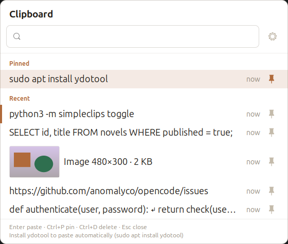
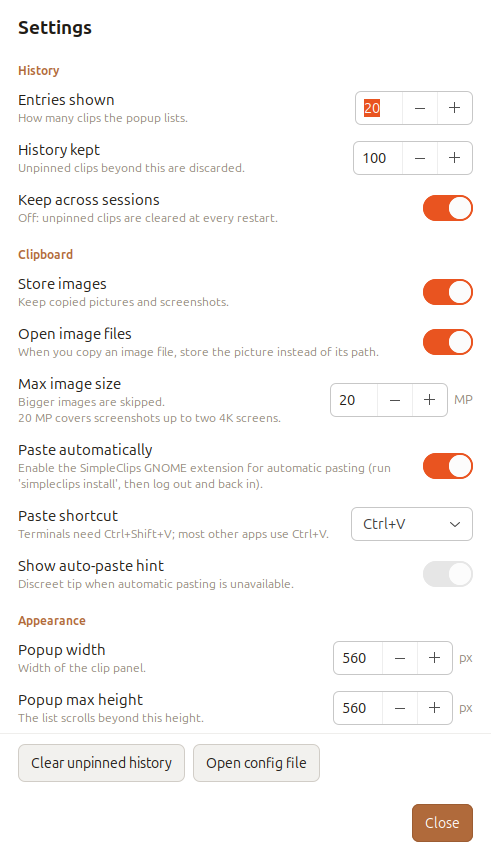

# SimpleClips


A tiny **Win+V style clipboard history for Linux desktops**. Press a shortcut,
a small panel opens *at your mouse pointer*, click an entry and it is pasted
where you were typing.

No databases, no cloud, no 200-option settings window. Text **and images**,
pinning, search — nothing more, nothing less.



> Built to replace CopyQ on GNOME/Wayland: the basics did not work, and the
> rest was more configuration than the job needed. See
> [Development](#development) for how it was made.

## Features

- **Panel at the pointer** — opens next to the cursor, like Windows' `Win+V`.
- **Last clips, newest first** — 20 shown by default, 100 kept in history.
- **Pinned and recent groups** — pinned clips sit in their own section and
  are never evicted.
- **Full text on hover** — rows show a short preview; the tooltip reveals the
  whole clip, wrapped and with its line breaks intact.
- **Images too** — copied screenshots and pictures are stored as blobs, shown
  as thumbnails and put back on the clipboard with their original MIME type.
  Copying an image *file* gives you the picture, not its path.
- **Search** — type to filter text and image entries.
- **Active clip highlighted** — the entry currently on the system clipboard
  gets a discreet colored left border.
- **Auto-paste** — pastes for you right after you pick a clip, on GNOME
  Wayland too, and without ydotool. Falls back to ydotool/xdotool elsewhere,
  or simply copies and tells you what to install.
- **Keyboard driven** — arrows, `Enter`, `Ctrl+P`, `Ctrl+D`, `Esc`.
- **Top-bar icon** — sits with your other status icons; click it to open
  Settings, right-click for a small menu. The launcher entry also puts the
  app in the dash with its own icon.
- **Tiny** — a single Python process, GTK3, one JSON file and a folder of
  image blobs.

## How it works

SimpleClips is one long-running user process (a daemon) plus a thin CLI:

```
Desktop clipboard ──► daemon ──► JSON history + image blobs
                        │
   shortcut ──► simpleclips toggle ──► popup at pointer
```

- The clipboard is watched with GTK's `owner-change` signal (XFixes) when an
  X display is present — on GNOME this is what sees copies made by
  Wayland-native apps, since `wl-paste --watch` needs the wlroots
  data-control protocol that GNOME does not implement. Pure wlroots
  compositors use `wl-paste --watch`; anything else falls back to polling.
- The popup is a frameless GTK3 window. On a Wayland session it runs through
  **XWayland** (`GDK_BACKEND=x11`) because Wayland does not let applications
  place their own windows — this is what makes "open at the mouse" possible on
  GNOME.
- Selecting an entry puts it back on the clipboard and, when a paste backend
  is available, presses the paste shortcut for you (see *Auto-paste* below).
- Copying an **image file** from the file manager (which puts a path, not the
  picture, on the clipboard) is resolved to the image itself.

## Requirements

- Python **3.9+**
- PyGObject with **GTK 3** (`python3-gi`, `gir1.2-gtk-3.0`)
- A clipboard tool:
  - **Wayland**: `wl-clipboard` (`wl-paste` / `wl-copy`)
  - **X11**: `xclip`
- *Optional*, for automatic pasting: **`ydotool`** (plus its daemon)

On Ubuntu / Debian:

```bash
sudo apt install python3-gi gir1.2-gtk-3.0 gir1.2-gdkpixbuf-2.0 wl-clipboard
sudo apt install ydotool        # optional: enables automatic Ctrl+V
```

### Top-bar icon, cursor placement and pasting on GNOME

Wayland does not let an application read the global cursor position, synthesize
a keystroke, or add a top-bar indicator. So `simpleclips install` also installs
a small **GNOME Shell extension** (`simpleclips@simpleclips.github.io`) that
provides all three:

- an icon in the top bar — **left click opens Settings**, right click shows a
  menu with *Open clipboard* and *Settings*;
- the real pointer position, so the popup opens at the cursor;
- the paste shortcut, applied when you pick a clip.

It only acts when you ask for it.

The top-bar button uses a **symbolic** (line-art) mark, installed into your
icon theme so GNOME recolours it and it stays visible on a light or dark bar.
The detailed illustration is used everywhere it has room — launcher, dash,
window and notifications — as pre-scaled PNGs in the same theme.

After installing, **log out and back in once** so GNOME Shell loads it
(Wayland cannot reload the Shell in place). Check with `simpleclips doctor`:
`pointer source` should say `gnome-shell` and `paste backend` should say
`gnome-shell`.

On an X11 session the X pointer is exact and no extension is needed. On other
Wayland compositors (Sway, Hyprland, ...) placement falls back to the X
pointer and pasting needs `ydotool`.

### Auto-paste

Two options:

- **GNOME extension** (preferred, no extra software): installed by
  `simpleclips install`.
- **ydotool** — the generic Wayland path, for wlroots compositors:

  ```bash
  sudo apt install ydotool
  sudo systemctl enable --now ydotool
  ```

`simpleclips doctor` tells you which backend is active. If none is, SimpleClips
still copies the clip — you just press the paste shortcut yourself.

**Terminals** do not use `Ctrl+V`. Set *Paste shortcut* to `Ctrl+Shift+V` in
Settings if you mostly paste into a terminal.

## Install

### With pipx (recommended)

PyGObject (`gi`) is a system package and cannot be installed from PyPI, so the
pipx environment must be allowed to see system packages:

```bash
pipx install --system-site-packages .
# or once published:  pipx install --system-site-packages simpleclips
simpleclips install       # systemd user service + Super+Alt+V shortcut
```

`simpleclips install` does three things:

1. writes and enables a **systemd user service** so the daemon starts with
   your session;
2. binds **`Super+Alt+V`** to `simpleclips toggle` through GNOME's custom
   shortcuts (via `gsettings`);
3. installs the **GNOME Shell extension** and the **app icon**.

Use a different shortcut with:

```bash
simpleclips install --hotkey '<Super><Shift>v'
```

To remove them: `simpleclips uninstall`.

> Running from a source checkout without installing? Start it manually with
> `python3 -m simpleclips daemon` (with `PYTHONPATH=src`) and bind your own
> shortcut to `simpleclips toggle`.

## Usage

Press **`Super+Alt+V`**, then:

| Key            | Action                          |
| -------------- | ------------------------------- |
| `↑` `↓`        | move selection                  |
| `PgUp` `PgDn`  | move by five                    |
| type           | filter clips                    |
| `Enter` / click| copy (and paste, if possible)   |
| `Ctrl+P`       | pin / unpin selected            |
| `Ctrl+D`       | delete selected                 |
| `Esc`          | close                           |

## CLI

```
simpleclips daemon      run in the foreground (usually via systemd)
simpleclips toggle      open/close the popup (bind this to a shortcut)
simpleclips show|hide   open/close the popup
simpleclips status      daemon status (backend, clip counts)
simpleclips list        print stored clips
simpleclips clear       drop unpinned history
simpleclips stop        stop a running daemon
simpleclips settings    open the settings window
simpleclips pick [N]    copy the Nth clip to the clipboard
simpleclips doctor      print environment diagnostics
simpleclips install     install systemd service + GNOME shortcut
simpleclips uninstall   remove them
```

## Settings

Every option has a small settings window — no JSON editing required:

```bash
simpleclips settings        # or click the gear in the popup footer
```



Changes are applied and saved immediately (no OK/Cancel). The same options
are also available in `~/.config/simpleclips/config.json`, which stays plain
JSON if you prefer editing it:

```json
{
  "max_items": 20,
  "max_history": 100,
  "persist_history": true,
  "paste": true,
  "paste_shortcut": "ctrl+v",
  "popup_width": 560,
  "popup_max_height": 560,
  "show_paste_hint": true,
  "images": true,
  "image_files": true,
  "max_image_pixels": 20000000,
  "max_image_bytes": 67108864,
  "autostart": true
}
```

- `max_items` — how many entries the panel shows.
- `max_history` — how many unpinned entries are kept on disk.
- `persist_history` — `true` (default): unpinned clips survive a restart,
  up to `max_history`. `false`: they are cleared at every session start and
  only pinned clips persist.
- `paste` — allow automatic pasting after you pick a clip.
- `paste_shortcut` — `ctrl+v` (default), `ctrl+shift+v` (terminals) or
  `shift+insert`.
- `images` — store image clips.
- `image_files` — when you copy an image *file*, store the picture instead of
  its path (default on). Turn off if you want the path as text.
- `max_image_pixels` — skip images above this many pixels (default 20 MP: a
  screenshot of two 4K screens is 16.6 MP). Measured from the file header, so
  an oversized image is rejected without ever being decoded.
- `max_image_bytes` — byte-size safety net (default 64 MB) for the rare
  malformed or unusual file.
- `popup_width` / `popup_max_height` — panel size in pixels.

History lives in `~/.local/share/simpleclips/history.json`; image blobs in
`~/.local/share/simpleclips/images/`. Delete either directory for a fresh
start.

## Running from source

```bash
python3 -m pytest tests -q     # unit tests
PYTHONPATH=src python3 -m simpleclips doctor
PYTHONPATH=src python3 -m simpleclips daemon
```

## Stack

| Layer | Choice | Why |
| --- | --- | --- |
| Language | Python 3.9+ | no build step, ships everywhere, easy to read |
| UI | GTK 3 + PyGObject | the native stack on GNOME; GTK4 cannot position a window at the cursor |
| Compositor glue | ~60-line GNOME Shell extension (GJS) | Wayland hides the pointer and blocks synthetic input; the extension asks the compositor instead |
| Clipboard | `wl-clipboard` on Wayland, `xclip` on X11 | detect at runtime, no hard dependency |
| Paste | GNOME extension, then `ydotool`, then `xdotool` | works on stock GNOME with nothing to install |
| Storage | one JSON file + a folder of image blobs | inspectable, greppable, no database |
| IPC | Unix socket, one daemon + thin CLI | the shortcut stays a fast, disposable command |
| Tests | pytest, 71 tests | placement maths, store invariants, header parsing, IPC |

No third-party runtime dependencies: everything comes from the Python
standard library, PyGObject, and the clipboard tools already present.

## Development

This project was built **iteratively with an AI coding agent**: each feature
was implemented, exercised on a real GNOME/Wayland session, and adjusted from
what the screen actually showed — including the parts that did not work the
first time.

- **Human (IO)** — defined the product: a `Win+V` for Linux, nothing more;
  tested every build on the desktop; reported each defect in words
  ("the panel opens in the corner", "the padding is zero", "images cannot be
  pasted", "fonts are unreadable"); chose the trade-offs.
- **Code Agent (opencode)** — explored the environment, wrote and refactored
  the code, added the tests, and ran the diagnostics.
- **LLM (DeepSeek Flash)** — the model behind the agent.

That loop is why several design decisions look the way they do. A few were
found by measurement, not assumption:

- the first popup had no background: `set_app_paintable` disables GTK's own
  painting, so it had to draw its own;
- `Gtk.EventBox` ignores CSS padding, so the inset moved to the inner box;
- `wl-paste --watch` is a no-op on GNOME (no data-control protocol), so
  watching moved to GTK's `owner-change` signal;
- on Wayland the XWayland pointer freezes over native windows, so positioning
  needed the shell extension;
- `Gtk.EventBox` sizing, `set_with_data` absence, and a stop() that deleted a
  socket it never created — each caught by a test or a live check.

## Roadmap

- Per-entry preview for long text.
- Configurable global shortcuts.
- Packaging: `.deb`, AUR, Flatpak.
- Support for wlroots compositors with `wlr-layer-shell`.

## License

MIT — see [LICENSE](LICENSE).
